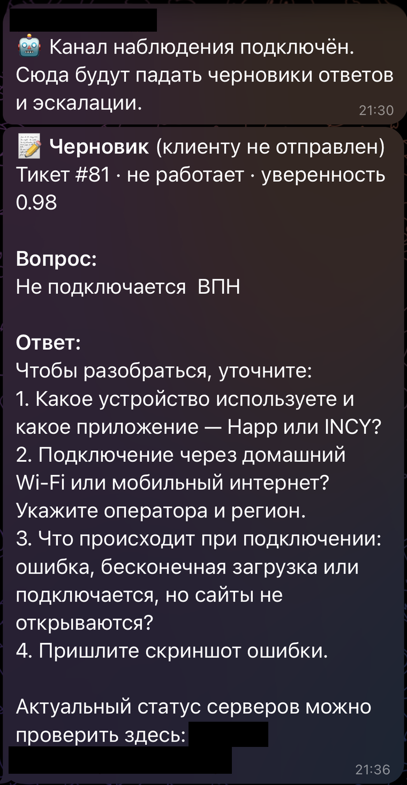

# bedolada-support

[](https://github.com/AirP0WeR/bedolada-support/actions/workflows/ci.yml)
[](https://github.com/AirP0WeR/bedolada-support/actions/workflows/docker.yml)


ИИ-автоответчик на тикеты встроенной поддержки бота
[bedolaga](https://github.com/BEDOLAGA-DEV/remnawave-bedolaga-telegram-bot).
Сам отвечает на типовые обращения, всё остальное молча отдаёт людям. Работает
поверх существующего web API бота — код самого бота не трогает и не требует
его правок.

Подходит любому проекту на бедолаге: название сервиса, база знаний и пороги
задаются настройками.

## Как работает

```
Клиент ──► бедолага ◄── опрос раз в 60 с ── bedolada-support
                     ── ответ / приоритет ──►     │
                                                  ├─► OpenAI (FAQ в кеш-префиксе + скриншоты)
                                                  ├─► SQLite (состояние, аудит)
                                                  └─► TG-топик наблюдения
```

Цикл по каждому тикету:

1. **Опрос** — `GET /tickets` по статусам `open` и `pending`, затем полный
   тикет с перепиской.
2. **Ворота** (`app/gate.py`) — решают без всякой модели, можно ли вообще
   трогать тикет: не ведёт ли его человек, не эскалирован ли он, не исчерпан
   ли лимит ответов, не свежее ли последнее сообщение дебаунса.
3. **Контекст** — переписка, факты об аккаунте (только чтение), скриншоты.
4. **Модель** — отвечает или передаёт оператору, строгим JSON.
5. **Пост-фильтр** (`app/guard.py`) — последняя проверка текста перед
   отправкой: ссылка на домен вне `ALLOWED_DOMAINS` (по умолчанию список
   пуст, то есть ссылки запрещены), денежная сумма или стоп-слово переводят
   тикет в эскалацию, что бы ни ответила модель.
6. **Действие** — ответ клиенту, либо `priority=high` без единого слова в
   тикет. Ошибка провайдера — тикет не трогаем совсем.

При остановке сервиса тикеты просто копятся и ждут людей, как было до него.

## База знаний

FAQ **не хранится в этом репозитории**: он тянется живьём из админки бота
(`GET /pages/faq`). Правка FAQ подхватывается в течение 15 минут, без коммита
и передеплоя. Последний удачный ответ кешируется на диск, чтобы недоступность
API не обнуляла базу.

В `kb/` кладём только то, чему во FAQ не место: внутренние шаги диагностики,
разбор частых поломок, вычищенные пары «вопрос — ответ» из закрытых тикетов.
Любой `.md` в этом каталоге попадает в промпт целиком — кроме `README.md`:
он написан для людей, которые ведут базу, и примеры в нём выдуманы.

## Запуск

Ставится рядом с ботом, в его же docker-сеть. Полная инструкция —
**[docs/deploy.md](docs/deploy.md)**, коротко:

```bash
git clone https://github.com/AirP0WeR/bedolada-support.git && cd bedolada-support
cp .env.example .env && nano .env          # токены бота и модели, имя сети бота
mkdir -p data && chown 1000:1000 data      # контейнер работает не от root

docker compose run --rm support-ai python -m app.main --check   # связность
docker compose up -d && docker compose logs -f
```

`--check` по очереди проверяет настройки, API бота, базу знаний, модель и
топик наблюдения — и говорит, чего не хватает, до того как это увидит первый
клиент.

Первые дни — с `AI_REPLY_ENABLED=false`. В этом режиме сервис делает всё то
же самое, но клиенту не пишет: готовые ответы падают в TG-топик, и по ним
видно, что он ответил бы. Когда качество устраивает — `true` и `compose up -d`.
Критерии, по которым это решают, — в [инструкции](docs/deploy.md#7-когда-включать-боевой-режим).

Разовый прогон без цикла: `python -m app.main --once`.

## Что видно в топике

Единственный интерфейс сервиса к человеку — сообщения в топике админ-форума.
По ним видно каждое решение, не открывая ни логов, ни базы:



Так выглядит теневой режим: черновик с темой, уверенностью, вопросом клиента
и готовым ответом — клиенту при этом не ушло ничего. Название сервиса и его
домен на снимке закрашены. Остальные виды сообщений:

```
📝 Черновик (клиенту не отправлен)
Тикет #1841 · подключение · уверенность 0.93

Вопрос:
Как подключить на айфоне?

Ответ:
Установите Happ из App Store, затем в боте «Моя подписка» → «Подключиться»
и добавьте ссылку в приложение.
```

```
🔺 Передан оператору
Тикет #1843 · приоритет high

Вопрос:
Списали дважды за месяц, верните деньги

Причина: спорное списание — денежный вопрос
```

```
📊 Сводка за сутки
Ответов клиентам: 27
Передано операторам: 9
Средняя уверенность: 0.88
Токенов на вход: 412 900 (из них 389 100 из кеша)
```

## Аварийный выключатель

Одна команда гасит ответы клиентам, не останавливая наблюдение:

```bash
sed -i 's/^AI_REPLY_ENABLED=.*/AI_REPLY_ENABLED=false/' .env && docker compose up -d
```

Сервис продолжит разбирать тикеты и писать черновики в TG-топик, но клиенту
не напишет ни слова. Тикеты копятся и ждут людей — ровно как до внедрения.
Если нужно остановить и это, `docker compose stop`: незавершённых действий
не останется, отметка о начатом ответе разбирается на следующем старте.

## Что нужно от бота

Сервисный токен создаётся в админке бота (Web API → токены). **Токен не
разграничен по правам**: он даёт полный доступ к webapi бота, включая
изменение балансов и подписок. Сервис пользуется только этим:

| Метод | Зачем |
|---|---|
| `GET /tickets?status=&limit=&offset=` | Список активных тикетов |
| `GET /tickets/{id}` | Тикет с перепиской — по нему принимаются все решения |
| `POST /tickets/{id}/reply` | Ответ клиенту, единственная запись в тикет |
| `POST /tickets/{id}/priority` | Эскалация: `high`, без сообщения в тикет |
| `GET /tickets/{id}/messages/{id}/media` | Метаданные скриншота |
| `GET /media/{file_id}` | Сам файл: отдача закрыта тем же токеном |
| `GET /users/{id}` | Факты об аккаунте, только чтение |
| `GET /pages/faq` | База знаний живьём из админки |

Проверено на бедолаге 4.0.0. Минимум — 3.52.0: `GET /pages/faq` появился
в ней вместе с FAQ в информационных страницах, на более ранних сервис
останется без основной части базы знаний.

## Известные ограничения

- **Тикет, в который зашёл человек, сервис покидает навсегда.** Это касается
  и новых вопросов клиента в том же тикете — они уже не будут обработаны.
  Сделано осознанно: вклиниться в чужой разговор хуже, чем промолчать.
- **Потеря `state.db` уводит открытые тикеты в молчание.** Свои прошлые
  ответы сервис перестаёт узнавать и считает их чужими, то есть выходит из
  тикета. Ответить дважды он при этом не может.
- **Отвечает только на текст и скриншоты.** Голосовое, видео или документ в
  неотвеченных сообщениях — сразу эскалация.
- **Диалог сервис не ведёт.** Уточняющие вопросы в ответе он задать может,
  но дальше просто ждёт следующего сообщения клиента как обычный тикет. После
  `MAX_AI_REPLIES` ответов в одном тикете всё уходит человеку.
- **Ссылки в ответах по умолчанию запрещены.** Если ваш FAQ отправляет клиента
  на статус-страницу, сайт или чат, эти домены нужно перечислить в
  `ALLOWED_DOMAINS` — иначе ответ отбракуется и тикет уйдёт оператору.
  Какие именно домены, подскажет `--check`, прочитав вашу базу знаний.

## Сколько это стоит

Стоимость определяется не числом тикетов, а размером базы знаний: она целиком
лежит в системном промпте, а он в каждом обращении один и тот же.

При базе в 8000 символов неизменяемый префикс — около 97% запроса
(правила плюс FAQ), и провайдер отдаёт его из кеша. Меняется только хвост:
переписка, факты об аккаунте и вопрос — три-четыре сотни символов.

Прикидка на один тикет: один запрос к модели, из него ~9/10 входных токенов
кешированные, ответ — сотня-другая токенов. Тикет с уточнением стоит два
запроса (`MAX_AI_REPLIES`), скриншот добавляет отдельную стоимость картинки.

Считать по своим ценам удобнее всего по факту, а не по прикидкам: включите
`DIGEST_HOUR`, и в топик раз в сутки придёт реальный расход:

```
Токенов на вход: 412 900 (из них 389 100 из кеша)
Токенов на выход: 5 380
```

Умножьте на прайс своей модели — цифры за сутки, по ним же видно, окупается
ли более дорогая модель. Всё, что отсеяли ворота, не стоит ничего: до модели
эти тикеты не доходят.

Чем короче база знаний, тем дешевле — но тем чаще сервис зовёт оператора.
Это единственный по-настоящему значимый рычаг цены.

## Приватность и данные

Что уходит в модель по каждому обрабатываемому тикету: переписка (последние
20 сообщений), факты об аккаунте (статус подписки, тариф, трафик, лимит
устройств, язык) и до одного скриншота. Ссылка на подписку в контекст
намеренно **не** кладётся — это ключ доступа клиента, и модель не должна иметь
возможности вставить его в ответ.

Что не уходит в модель вовсе: тикеты, отсеянные воротами. Сервис читает их
из API бота, но ни переписку, ни скриншоты из них наружу не отправляет.

Что хранится на вашем сервере: `state.db` с состоянием тикетов и аудитом,
в котором лежат тексты обращений и ответов. Аудит чистится по
`AUDIT_RETENTION_DAYS` (90 дней), состояние — бессрочно, но в нём только id.

Если провайдер модели вас не устраивает — `OPENAI_BASE_URL` переключает
сервис на любой OpenAI-совместимый шлюз, включая локальный.

## Настройки

Значимые переменные (полный список в `.env.example`):

| Переменная | Смысл |
|---|---|
| `AI_REPLY_ENABLED` | `false` — теневой режим, клиенту не отвечаем |
| `POLL_INTERVAL_SEC` | Период опроса, по умолчанию 60 |
| `DEBOUNCE_SEC` | Не трогаем тикет, пока сообщение свежее этого |
| `MAX_AI_REPLIES` | Сколько раз ИИ отвечает в одном тикете, потом эскалация |
| `CONFIDENCE_THRESHOLD` | Ниже порога — тикет уходит человеку |
| `KB_LANGUAGES` | Языки, на которых забираем FAQ |
| `ALLOWED_DOMAINS` | Домены, ссылки на которые поддержка вправе присылать клиенту; пусто — никаких ссылок |
| `STOP_WORDS` | Слова, при которых ответ уходит оператору |
| `ALERT_AFTER_FAILURES` | Сколько сбоев подряд терпим молча |
| `DIGEST_HOUR` | Час суточной сводки в топик; пусто — не шлём |
| `AUDIT_RETENTION_DAYS` | Сколько дней держим переписку в аудите |
| `API_TZ` | Таймзона дат, которые API отдал без таймзоны |

Перед отправкой ответ проходит пост-фильтр (`app/guard.py`): ссылка на
неразрешённый домен, денежная сумма или стоп-слово уводят тикет к оператору,
что бы ни ответила модель. Причина видна в топике наблюдения и в аудите.

В аудите (`state.db`) лежат тексты обращений и ответов. Записи старше
`AUDIT_RETENTION_DAYS` (90 дней) удаляются на старте и раз в сутки; `0` —
хранить бессрочно.

## Разработка

Зависимости и окружение — [uv](https://docs.astral.sh/uv/). Версии
зафиксированы в `uv.lock`, из него же ставится образ.

```bash
uv sync                                  # venv по локу, вместе с dev-группой
uv run pytest -q
uv run ruff format . && uv run ruff check .
uv lock --upgrade-package openai         # обновить одну зависимость
```

Ворота и разбор вердикта покрыты тестами покейсово — это единственные места,
где решается, увидит ли клиент ответ. Менять их без теста на новый случай не
стоит. Подробнее — [CONTRIBUTING.md](CONTRIBUTING.md).

## Образ

Собирается в GHCR при пуше в `main` и на тегах `v*.*.*`:
`ghcr.io/airp0wer/bedolada-support`. Теги — `latest` с main, неизменяемый
`sha-<коммит>`, а на релизах `X.Y.Z`, `X.Y` и `X.Y.Z-<sha>`.
